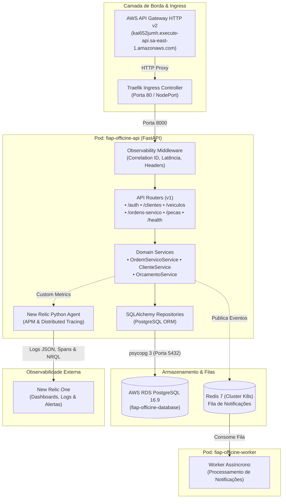

# 🚗 fiap-officine-api — API Principal & Worker de Gestão de Ordens de Serviço

**Tech Challenge FIAP (15SOAT)**  
Repositório oficial do microsserviço principal do ecossistema **fiap-officine**, responsável por toda a lógica de negócio, gestão de clientes, veículos, peças, serviços, fluxo de transição de ordens de serviço e observabilidade em tempo real.

---

## 🎯 Propósito do Repositório

O **fiap-officine-api** implementa o núcleo da oficina mecânica sob os princípios do **Domain-Driven Design (DDD)** e **Clean Architecture**:
* **Gestão e Acompanhamento de Ordens de Serviço (OS)**: Criação de ordens com identificação de cliente (CPF), cálculo automático de orçamento (peças + mão de obra), máquina de estados com transições estritas (`Recebida → Diagnóstico → Aguardando Aprovação → Execução → Finalizada → Entregue`).
* **Proteção de Dados e Rotas Sensíveis por CPF**: Apenas o cliente titular autenticado via token JWT tem acesso às suas ordens de serviço e veículos cadastrados.
* **Mensageria Assíncrona e Webhooks**: Notificação assíncrona de eventos via fila Redis para workers desacoplados, além de webhooks de aprovação de orçamento e atualização via e-mail.
* **Observabilidade e Monitoramento Completo (New Relic)**:
  - Instrumentação nativa via APM New Relic.
  - Logs estruturados em formato JSON com propagação de `X-Correlation-ID` e `X-Request-ID`.
  - Healthchecks de liveness e readiness (`/health` e `/api/v1/health`) avaliando PostgreSQL e Redis com métricas de latência.
  - Emissão de eventos customizados (`OrdemServicoEvent`, `OrdemServicoProcessingFailure`, `WorkerProcessingFailure`) para cálculo de tempo médio por status, volume diário e alertas de falhas.

---

## 🏗️ Diagrama da Arquitetura do Repositório



---

## 🚀 Tecnologias Utilizadas

| Categoria | Tecnologia | Justificativa / Uso |
| :--- | :--- | :--- |
| **Linguagem** | **Python 3.12** | Tipagem estática avançada, alta performance e sintaxe moderna |
| **Framework Web** | **FastAPI 0.115+** | Alta performance assíncrona, validação Pydantic v2 e Swagger nativo |
| **Gerenciador de Pacotes** | **uv** | Resolução determinística e ultra-rápida de dependências |
| **Acesso a Dados (ORM)** | **SQLAlchemy 2.0** | Padrão Repository, queries tipadas e migrações estruturadas |
| **Driver PostgreSQL** | **psycopg 3 (`psycopg[binary]`)** | Driver C moderno, alta performance e suporte total ao PostgreSQL 16 |
| **Banco de Dados** | **PostgreSQL 16.9** | ACID compliance, integridade referencial para estoque e orçamentos |
| **Fila & Cache** | **Redis 7** | Mensageria assíncrona para workers de notificação de OS |
| **Observabilidade (APM)** | **New Relic Python Agent (v13.5)** | Tracing distribuído, alertas em tempo real e dashboards NRQL |
| **Logs Estruturados** | **JSONLogFormatter** | Logs JSON com `correlation_id`, `trace_id` e `duration_ms` |
| **Containerização** | **Docker** | Build multi-stage, usuário não-root por segurança |
| **Orquestração** | **Kubernetes (K3s / EKS)** | Deployment, Service, HPA, Ingress e ConfigMaps |
| **CI/CD** | **GitHub Actions** | Validação, testes automatizados e deploy contínuo |

---

## 📡 Documentação das APIs (Swagger & Postman)

A documentação interativa e os contratos OpenAPI podem ser consultados diretamente pelos links abaixo:

* **Swagger UI (Interativo no API Gateway)**:  
  👉 [https://kai652jumh.execute-api.sa-east-1.amazonaws.com/docs](https://kai652jumh.execute-api.sa-east-1.amazonaws.com/docs)
* **ReDoc (Documentação Técnica Detalhada)**:  
  👉 [https://kai652jumh.execute-api.sa-east-1.amazonaws.com/redoc](https://kai652jumh.execute-api.sa-east-1.amazonaws.com/redoc)
* **Contrato OpenAPI JSON (Postman / Insomnia)**:  
  👉 [https://kai652jumh.execute-api.sa-east-1.amazonaws.com/openapi.json](https://kai652jumh.execute-api.sa-east-1.amazonaws.com/openapi.json)
* **Arquivo OpenAPI Local (Versionado)**:  
  [`docs/openapi.json`](docs/openapi.json) — Importável no Postman (Menu *Import* ➔ Arraste o arquivo `openapi.json`).

### 🔐 Comportamento de Acesso e Códigos de Retorno das Rotas

| Tipo de Rota | Endpoints | Autorização | Comportamento e Resposta |
| :--- | :--- | :--- | :--- |
| **Públicas** | `/health`, `/docs`, `/openapi.json`, `/redoc` | Nenhuma (`NONE`) | `200 OK` (retorna `503 Service Unavailable` apenas em janelas breves de reinicialização ou cold start do nó EC2 Free Tier) |
| **Autenticação** | `POST /auth/login` | Nenhuma (Valida CPF) | `200 OK` contendo o `access_token` JWT assinado pela Lambda |
| **Protegidas** | `/api/v1/ordens-servico/*`, `/api/v1/clientes/*`, etc. | **Bearer JWT Obrigatório** | • **Sem Token ou Inválido**: `401 Unauthorized` (bloqueado pelo **Lambda Authorizer** no API Gateway antes de tocar o cluster)<br>• **Com Token Válido**: `200 OK` / `201 Created` processado pela API |

---

## 🛠️ Como Executar Localmente

### Pré-requisitos
* [Python 3.12+](https://www.python.org/)
* [uv](https://docs.astral.sh/uv/) ou [Docker & Docker Compose](https://www.docker.com/)

### Opção A: Execução com Docker Compose (Ambiente Completo)
```bash
# 1. Clonar o repositório
git clone https://github.com/fiap-officine/fiap-officine-api.git
cd fiap-officine-api

# 2. Configurar variáveis de ambiente
cp .env.example .env

# 3. Subir API, Worker, Redis e PostgreSQL
docker compose up --build
```
Acesse a aplicação em: `http://localhost:8000/docs`

---

### Opção B: Execução Local Nativa com `uv`
```bash
# 1. Instalar dependências e criar venv
uv sync

# 2. Executar migrações do banco
uv run alembic upgrade head

# 3. Iniciar o servidor da API
uv run uvicorn app.main:app --host 0.0.0.0 --port 8000 --reload

# 4. Iniciar o worker de notificações (em outro terminal)
uv run python -m app.worker
```

---

## 🧪 Execução de Testes Automatizados

A base conta com 183 testes unitários e de integração com cobertura superior a 93%:

```bash
# Executar suíte completa de testes com cobertura
uv run pytest -v --cov=app --cov-report=term-missing

# Executar apenas testes de observabilidade e logs JSON
uv run pytest tests/unit/test_observability.py -v
```

---

## 🚢 Passos para Deploy

### 1. Deploy Automático via CI/CD (GitHub Actions)
* **Ambiente de Homologação (AWS sa-east-1)**: Disparado automaticamente ao realizar push ou merge na branch `develop`.
* **Ambiente de Produção**: Disparado automaticamente ao realizar push ou merge na branch `main`.

### 2. Deploy Manual no Cluster Kubernetes
```bash
# Aplicar namespace, secrets e configurações
kubectl apply -f k8s/namespace.yaml
kubectl apply -f k8s/configmap.yaml
kubectl apply -f k8s/secret.yaml

# Aplicar Redis e Banco
kubectl apply -f k8s/redis-deployment.yaml
kubectl apply -f k8s/redis-svc.yaml

# Aplicar API, Worker, Ingress e HPA
kubectl apply -f k8s/api-deployment.yaml
kubectl apply -f k8s/api-svc.yaml
kubectl apply -f k8s/worker-deployment.yaml
kubectl apply -f k8s/ingress.yaml
kubectl apply -f k8s/api-hpa.yaml

# Aplicar DaemonSet de Monitoramento New Relic
kubectl apply -f k8s/newrelic-infrastructure.yaml
```

---

## 📊 Observabilidade & Dashboards New Relic

A aplicação registra métricas e eventos customizados para alimentar os seguintes dashboards no **New Relic One**:

1. **Volume Diário de Ordens de Serviço**:
   ```sql
   SELECT count(*) FROM OrdemServicoEvent WHERE event_type = 'os_created' FACET dateOf(timestamp) SINCE 7 days ago
   ```
2. **Tempo Médio de Execução por Status (Diagnóstico, Execução, Finalização)**:
   ```sql
   SELECT average(duration_seconds) / 60 AS 'Tempo Médio (min)' FROM OrdemServicoEvent WHERE event_type = 'status_transition' FACET status_target SINCE 7 days ago
   ```
3. **Latência de Endpoints (p50, p95, p99)**:
   ```sql
   SELECT percentile(duration, 50, 95, 99) FROM Transaction WHERE appName = 'fiap-officine-api' TIMESERIES SINCE 24 hours ago
   ```
4. **Falhas de Processamento & Erros em Integrações**:
   ```sql
   SELECT count(*) FROM OrdemServicoProcessingFailure, WorkerProcessingFailure FACET error_type, order_id SINCE 24 hours ago
   ```

Consulte a documentação completa em [docs/observability.md](file:///c:/Users/phpra/projects/fiap-pos/docs/observability.md).

---

## 🔒 Governança de Branches
* `main`: Branch de Produção (Commits diretos bloqueados).
* `develop`: Branch de Homologação (Deploy contínuo em Homologação).
* **PR Obrigatório**: Testes e checagens estáticas devem passar compulsoriamente antes de qualquer merge.
