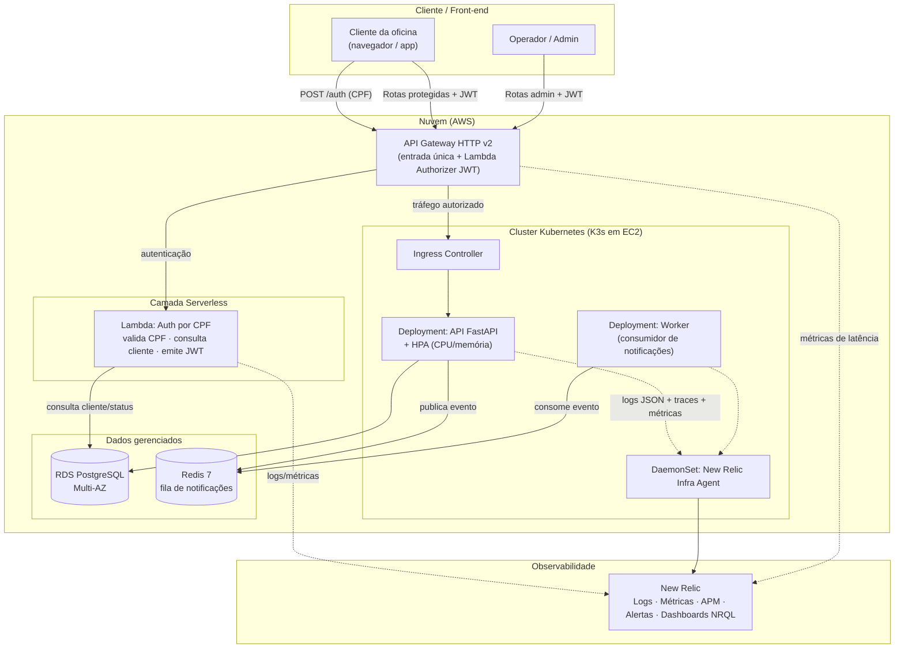
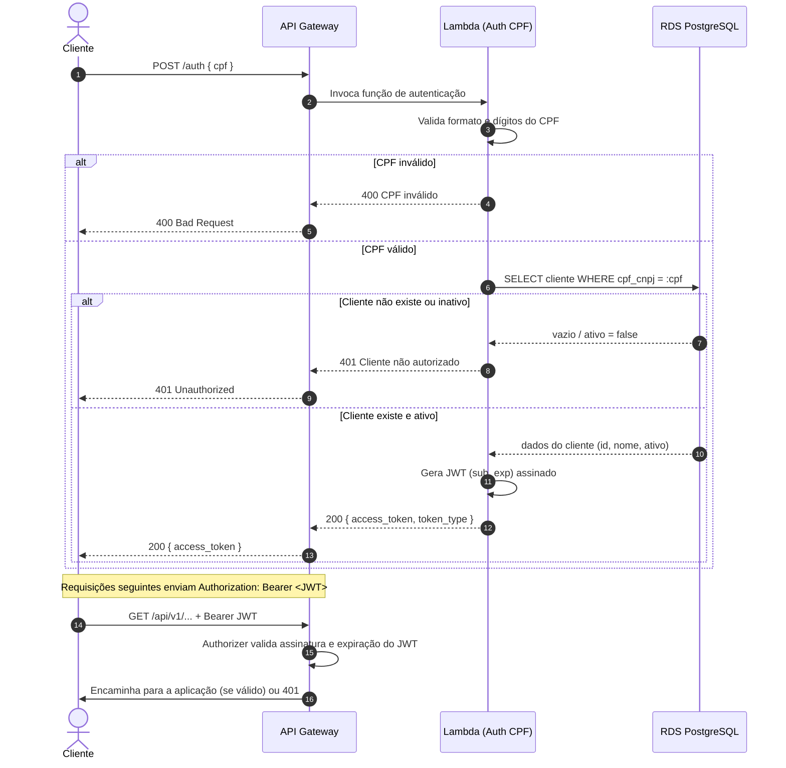
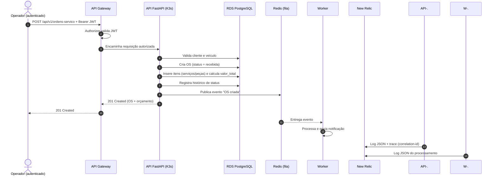
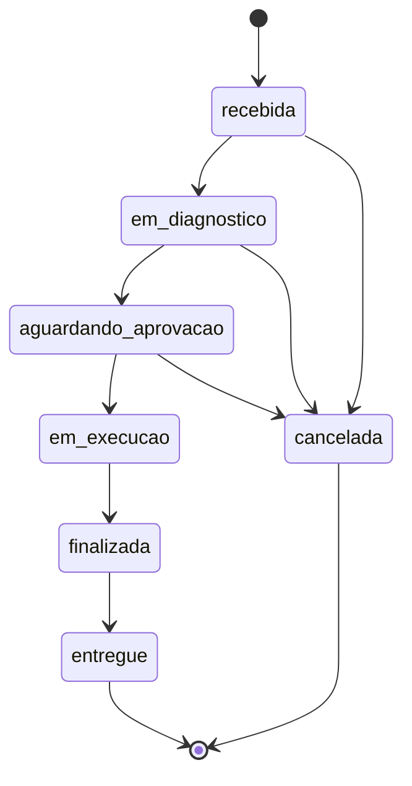

# Documentação de Arquitetura — Oficina Mecânica (Fase 3)

Este diretório reúne a documentação arquitetural da aplicação de gestão de
oficina mecânica, evoluída na Fase 3 para operação em nuvem com autenticação
serverless, banco gerenciado, cluster Kubernetes escalável, observabilidade e
CI/CD segregado por repositório.

> **Nuvem de referência:** AWS. A justificativa formal está na
> [RFC-001](rfc/RFC-001-escolha-nuvem.md). Todo o desenho se traduz de forma
> equivalente para GCP/Azure (API Gateway → Apigee/APIM, Lambda → Cloud
> Functions/Azure Functions, RDS → Cloud SQL/Azure Database, EKS → GKE/AKS).

## Índice

| Documento | Conteúdo |
|---|---|
| [Modelo de Dados](data-model.md) | Justificativa do banco, diagrama ER e relacionamentos |
| [ADRs](adr/README.md) | Decisões arquiteturais permanentes |
| [RFCs](rfc/README.md) | Decisões técnicas em discussão/proposta |

---

## 1. Visão geral

A aplicação é um sistema de gestão de ordens de serviço (OS) para uma rede de
oficinas com múltiplas unidades. O núcleo de negócio (API + worker) roda em
Kubernetes; a autenticação de clientes por CPF é feita de forma **serverless**
(fora do cluster) e todo o tráfego externo entra por um **API Gateway** único.

Componentes principais:

- **API Gateway** — ponto único de entrada, roteamento e proteção das rotas
  sensíveis (ver [ADR-003](adr/ADR-003-api-gateway-auth-serverless.md)).
- **Função Serverless de Autenticação (Lambda)** — valida o CPF, consulta a
  existência/status do cliente no banco e emite um JWT.
- **Aplicação principal (FastAPI)** — regras de negócio de OS, clientes,
  veículos, serviços e peças; roda em Kubernetes com HPA.
- **Worker de notificações** — consome eventos da fila (Redis) e dispara
  notificações de forma assíncrona.
- **Banco de dados gerenciado (RDS PostgreSQL)** — persistência transacional
  (ver [RFC-002](rfc/RFC-002-banco-de-dados.md) e [ADR-005](adr/ADR-005-banco-gerenciado.md)).
- **Observabilidade (New Relic)** — logs estruturados, métricas, APM e alertas
  (ver [RFC-004](rfc/RFC-004-observabilidade.md)).

---

## 2. Diagrama de Componentes (visão de nuvem)

---

## 3. Diagrama de Sequência — Autenticação por CPF

Fluxo serverless de autenticação. O cliente informa o CPF; a função valida o
documento, confirma a existência e o status na base e devolve um JWT usado nas
rotas protegidas.

---

## 4. Diagrama de Sequência — Abertura de Ordem de Serviço

Fluxo de negócio de criação de uma OS já autenticado, incluindo cálculo
automático de orçamento e notificação assíncrona via fila.

---

## 5. Fluxo de status da OS

Máquina de estados implementada em `app/domain/enums.py` (`TRANSICOES_VALIDAS`).
Transições fora deste grafo são rejeitadas pela camada de serviço.

---

## 6. Rastreabilidade requisito → documento

| Requisito do enunciado (Fase 3) | Onde é atendido |
|---|---|
| API Gateway para roteamento/controle | [ADR-003](adr/ADR-003-api-gateway-auth-serverless.md), §2 |
| Function serverless de autenticação por CPF | [RFC-003](rfc/RFC-003-autenticacao-cpf.md), §3 |
| Banco de dados gerenciado | [RFC-002](rfc/RFC-002-banco-de-dados.md), [ADR-005](adr/ADR-005-banco-gerenciado.md) |
| Cluster Kubernetes escalável (HPA) | [ADR-002](adr/ADR-002-hpa-escalabilidade.md) |
| Terraform / IaC e 4 repositórios | [ADR-004](adr/ADR-004-repositorios-cicd.md) |
| Monitoramento e observabilidade | [RFC-004](rfc/RFC-004-observabilidade.md) |
| Padrão de comunicação | [ADR-001](adr/ADR-001-padrao-comunicacao.md) |
| Diagramas de componentes e sequência | Este documento, §2–§4 |
| Justificativa do banco + modelo ER | [data-model.md](data-model.md) |
