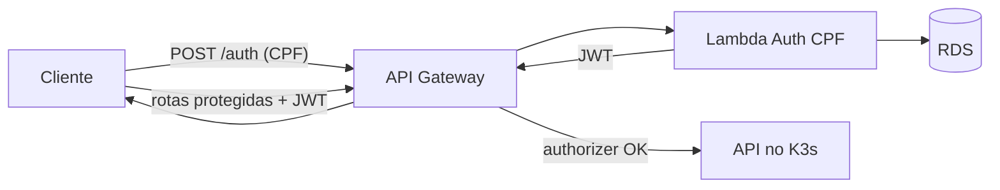

# ADR-003 — API Gateway como entrada única e autenticação serverless

- **Status:** Aceito
- **Data:** 2025-07
- **Decisores:** Grupo 123
- **Relacionado a:** [RFC-003](../rfc/RFC-003-autenticacao-cpf.md), [RFC-001](../rfc/RFC-001-escolha-nuvem.md)

## Contexto

A Fase 3 exige controlar acessos e autenticações com segurança, proteger rotas
sensíveis com autenticação via CPF e adotar soluções **serverless** para
autenticação. Na Fase 2 a autenticação era feita dentro do próprio monólito
(usuário/senha + JWT), o que acopla o ciclo de vida do mecanismo de auth ao da
aplicação e não oferece um ponto único de controle de tráfego externo.

## Decisão

1. **API Gateway (HTTP API v2) como ponto único de entrada.** Todo o tráfego externo passa
   pelo gateway, responsável por roteamento, throttling, TLS e validação do JWT via
   **Lambda Authorizer** antes de encaminhar às rotas protegidas no cluster.

2. **Autenticação por CPF em função serverless (Lambda), fora do cluster.** A
   função:
   - valida o formato e os dígitos verificadores do CPF;
   - consulta a existência e o `status` (`ativo`) do cliente no banco;
   - gera e devolve um **JWT** assinado, válido para consumir as APIs
     protegidas.

3. A aplicação em Kubernetes deixa de emitir token para clientes; confia no JWT
   validado pelo gateway. O login administrativo (operadores) permanece como
   fluxo próprio.

## Consequências

**Positivas**
- Autenticação desacoplada, escalando de forma independente e com custo por uso
  (serverless, sem pod ocioso).
- Ponto único para aplicar segurança (throttling, WAF, rate limit) e observar
  latência de borda.
- Superfície de ataque reduzida: a aplicação só recebe tráfego já autorizado.

**Negativas / trade-offs**
- Mais peças de infraestrutura (gateway + função) e uma dependência de rede da
  Lambda ao banco (exige VPC/subnet configurada).
- *Cold start* da função pode adicionar latência à primeira autenticação —
  aceitável para um endpoint de auth de baixa frequência; mitigável com
  provisioned concurrency se necessário.
- Segredo de assinatura do JWT precisa ser compartilhado de forma segura entre a
  Lambda (emissor) e o gateway/aplicação (validadores) via secret manager.

## Alternativas consideradas

- **Manter auth dentro do monólito:** não atende ao requisito de solução
  serverless nem ao ponto único de controle.
- **Ingress do Kubernetes como gateway:** cobre roteamento, mas concentra a
  autenticação novamente dentro do cluster e oferece menos recursos de borda que
  um API Gateway gerenciado.
