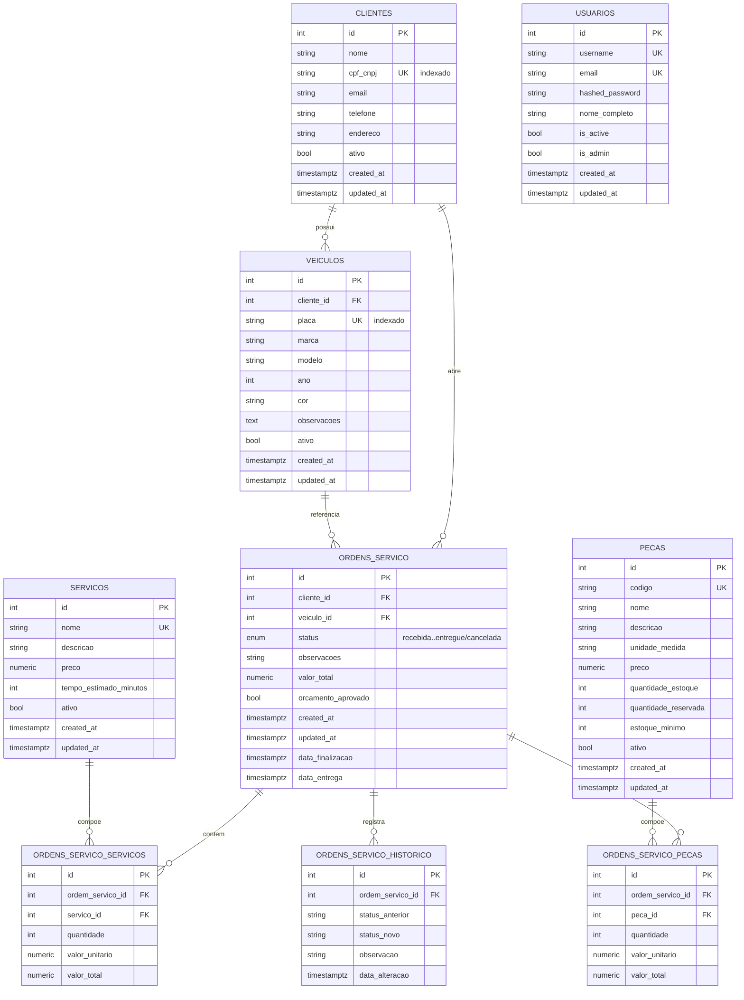

# Modelo de Dados — Justificativa e Diagrama ER

## 1. Justificativa formal da escolha do banco de dados

O banco escolhido é o **PostgreSQL** (na Fase 3, na modalidade **gerenciada —
Amazon RDS**). A decisão está formalizada na [RFC-002](rfc/RFC-002-banco-de-dados.md)
e na [ADR-005](adr/ADR-005-banco-gerenciado.md). Resumo dos motivos:

- **Conformidade ACID.** O domínio manipula estoque de peças, valores de
  orçamento e transições de status de OS. Essas operações exigem atomicidade e
  consistência forte — um banco relacional transacional é o ajuste natural, e um
  NoSQL exigiria reconstruir garantias que o PostgreSQL já oferece de fábrica.
- **Relacionamentos ricos.** O modelo é fortemente relacional: cliente →
  veículos → ordens de serviço → itens (serviços/peças). Consultas de negócio
  (histórico, tempo médio por status, OS por cliente) dependem de JOINs, chaves
  estrangeiras e integridade referencial.
- **Tipos adequados ao domínio.** `NUMERIC(10,2)` para valores monetários (sem
  erro de ponto flutuante), `ENUM` nativo para o status da OS e `TIMESTAMPTZ`
  para datas com fuso.
- **Ecossistema.** Integração madura com SQLAlchemy 2.0 (ORM) e Alembic
  (migrations), já em uso no projeto.
- **Operação gerenciada.** Em RDS, o time deixa de operar backup, patching,
  failover e réplicas manualmente. Multi-AZ entrega alta disponibilidade, um dos
  objetivos explícitos da fase.

## 2. Diagrama Entidade-Relacionamento

Modelo derivado das entidades em `app/domain/entities/`.

> `USUARIOS` é uma entidade isolada (operadores/admin do back-office) e não se
> relaciona com o domínio de OS — daí aparecer sem arestas no diagrama.

## 3. Explicação dos relacionamentos

- **Cliente 1—N Veículo** (`veiculos.cliente_id → clientes.id`). Um cliente pode
  ter vários veículos; todo veículo pertence a exatamente um cliente.
- **Cliente 1—N Ordem de Serviço** (`ordens_servico.cliente_id → clientes.id`).
  A OS guarda o cliente de forma direta (além do vínculo pelo veículo) para
  simplificar consultas de "OS por cliente" e o endpoint público de
  acompanhamento por CPF.
- **Veículo 1—N Ordem de Serviço** (`ordens_servico.veiculo_id → veiculos.id`).
  Cada OS trata de um veículo específico; o veículo acumula seu histórico de OS.
- **Ordem de Serviço N—N Serviço**, resolvida pela tabela associativa
  **`ordens_servico_servicos`**. A associativa carrega `quantidade`,
  `valor_unitario` e `valor_total` — o preço é **congelado no momento da
  inclusão**, para que reajustes futuros no catálogo de serviços não alterem
  orçamentos já emitidos.
- **Ordem de Serviço N—N Peça**, resolvida por **`ordens_servico_pecas`**, com a
  mesma estratégia de congelar preço e quantidade. É aqui que o consumo de peças
  se conecta ao controle de estoque (`pecas.quantidade_estoque` /
  `quantidade_reservada`).
- **Ordem de Serviço 1—N Histórico** (`ordens_servico_historico`). Cada
  transição de status gera um registro (`status_anterior`, `status_novo`,
  `data_alteracao`), servindo de trilha de auditoria e base para métricas de
  tempo por status.

O `valor_total` da OS é a soma dos `valor_total` das associativas de serviços e
peças (orçamento automático).

## 4. Ajustes no modelo relacional para a Fase 3

Evoluções recomendadas ao promover o banco a gerenciado, sem quebrar o modelo:

1. **Índices de suporte às consultas de negócio e observabilidade**
   - `ordens_servico(status)` — já indexado; sustenta a listagem por status e o
     dashboard de volume por status.
   - Índice composto `ordens_servico(status, created_at)` — acelera o "volume
     diário por status" exibido no dashboard (RFC-004).
   - `ordens_servico_historico(ordem_servico_id, data_alteracao)` — cálculo de
     tempo médio por status.
2. **Consistência de estoque.** Reserva/baixa de `quantidade_estoque` e
   `quantidade_reservada` deve ocorrer dentro da mesma transação da inclusão de
   peças na OS, com `SELECT ... FOR UPDATE` na linha da peça para evitar corrida
   entre unidades concorrentes.
3. **Chave de correlação.** Coluna opcional `correlation_id` (ou uso do
   `id` + trace do New Relic) para amarrar logs/traces a uma OS específica.
4. **Migrations versionadas.** Todas as alterações continuam via Alembic
   (`alembic/versions/`), aplicadas pelo pipeline do repositório de banco antes
   do deploy da aplicação.
5. **Segurança gerenciada.** Credenciais do RDS via Secrets Manager; conexão TLS
   obrigatória; instância em subnet privada, acessível apenas pelo cluster e pela
   Lambda de autenticação.
