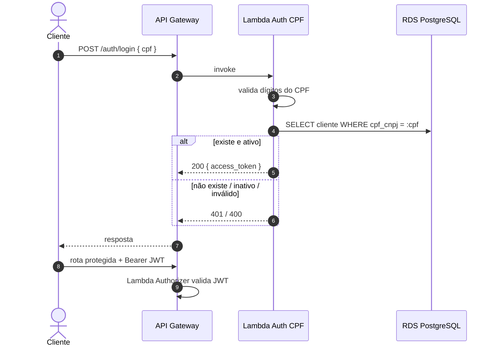

# RFC-003 — Estratégia de autenticação por CPF (serverless)

- **Status:** Aceita
- **Data:** 2025-07
- **Autores:** Grupo 123
- **Consolida em:** [ADR-003](../adr/ADR-003-api-gateway-auth-serverless.md)

## 1. Resumo

Propõe-se autenticar o cliente por **CPF** através de uma **função serverless
(AWS Lambda)** exposta pelo **API Gateway**, que valida o documento, confirma a
existência/status do cliente no banco e devolve um **JWT** para consumo das
rotas protegidas.

## 2. Motivação

A Fase 3 exige: proteger rotas sensíveis com autenticação via CPF, uma **função
serverless** que valide o CPF, consulte a base e gere um JWT. Na Fase 2 a
autenticação (usuário/senha) estava embutida no monólito — não é serverless e
acopla auth à aplicação.

## 3. Proposta

### 3.1 Fluxo

### 3.2 Contrato

- **Entrada:** `POST /auth/login` com `{ "cpf": "12345678909" }`.
- **Saída (sucesso):** `{ "access_token": "<jwt>", "token_type": "bearer" }`.
- **Erros:** `400` CPF inválido; `401` cliente inexistente ou inativo.

### 3.3 Token

- JWT assinado (HS256 ou RS256), claims mínimos: `sub` (id/cpf do cliente),
  `exp`, `iat`. Expiração curta e configurável.
- Chave de assinatura no **Secrets Manager**, compartilhada com o validador do
  gateway.
- Reaproveita a validação de CPF já existente no domínio
  (`app/domain/validators.py`), evitando divergência de regra.

### 3.4 Fronteira de responsabilidade

- **Cliente (CPF):** autenticado pela Lambda serverless — foco do requisito.
- **Operador/Admin (usuário/senha):** permanece com fluxo próprio da aplicação,
  fora do escopo desta RFC.

## 4. Alternativas consideradas

- **Cognito / provedor de identidade gerenciado:** robusto, porém excessivo para
  um login por CPF sem senha e menos aderente ao "escreva a função que valida o
  CPF" pedido no enunciado.
- **Auth no Ingress do cluster:** volta a concentrar autenticação dentro do
  cluster; não é serverless.

## 5. Riscos e mitigação

- **Cold start** na primeira chamada — aceitável para auth; provisioned
  concurrency se necessário.
- **CPF como identificador sensível** — não logar o CPF em claro; mascarar em
  logs (RFC-004) e trafegar sempre sobre TLS.
- **Acesso da Lambda ao banco** — exige a função na VPC com security group
  restrito ao RDS.

## 6. Decisão

**Aprovada.** Autenticação de cliente por CPF via Lambda + API Gateway,
emitindo JWT. Consolidada na ADR-003.
